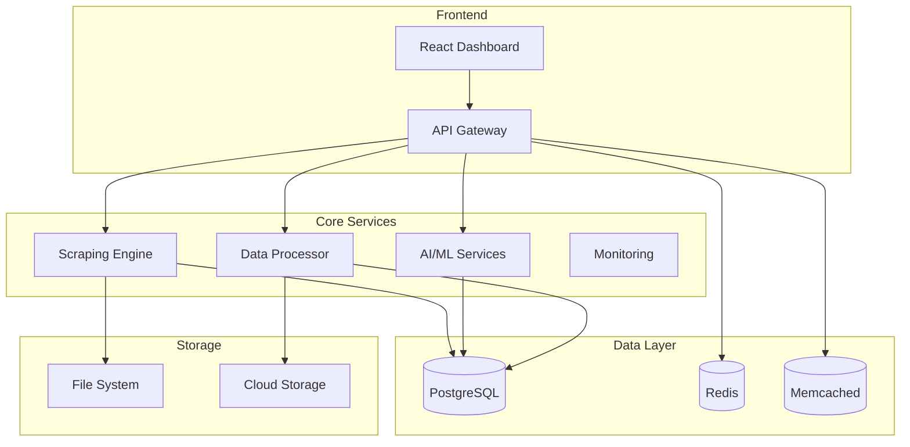

# SPIDER - Enterprise Web Scraping Framework

[](https://github.com/Exemplify777/spider)
[](https://python.org)
[](LICENSE)
[](https://github.com/Exemplify777/spider)

## 🚀 Overview

SPIDER is a comprehensive, enterprise-grade web scraping framework that combines multiple scraping technologies with advanced AI/ML capabilities, enterprise features, and cloud-native deployment options. Built for scale, security, and performance.

### ✨ Key Highlights

- **🎯 Multi-Engine Support**: Scrapy, Playwright, and HTTPX for diverse scraping needs
- **🤖 AI-Powered**: Machine learning for data extraction, validation, and analysis
- **🏢 Enterprise-Ready**: Multi-tenancy, security, compliance, and monitoring
- **☁️ Cloud-Native**: Deploy anywhere from local development to Kubernetes clusters
- **📊 Real-time Analytics**: Advanced monitoring, alerting, and performance insights
- **🔒 Production-Secure**: Enterprise-grade security with compliance standards

## 🏗️ Architecture



## 🚀 Quick Start

### Prerequisites

- Python 3.9+
- Node.js 16+ (for web interface)
- Docker (optional)
- 4GB+ RAM recommended

### Installation

```bash
# Clone repository
git clone https://github.com/Exemplify777/spider.git
cd spider

# Install dependencies
pip install -r requirements.txt
cd web/dashboard && npm install && cd ../..

# Run locally
python -m spider.main --config config/local.yaml
```

### Docker Deployment

```bash
# Quick start with Docker
docker-compose up -d

# Access web interface
open http://localhost:3000
```

### First Steps

1. **Access Dashboard**: Navigate to `http://localhost:3000`
2. **Create Account**: Register your first user account
3. **Configure Scraper**: Use the guided setup wizard
4. **Run Test**: Execute your first scraping job

## 🎯 Core Features

### Web Scraping Engines

| Engine | Best For | Features |
|--------|----------|----------|
| **Scrapy** | Large-scale crawling | Built-in scheduling, duplicate detection |
| **Playwright** | JavaScript sites | Full browser automation, screenshots |
| **HTTPX** | High-performance APIs | Async/await, connection pooling |

### AI/ML Capabilities

- **🤖 Natural Language Processing**: Sentiment analysis, entity recognition, text classification
- **👁️ Computer Vision**: OCR, object detection, image classification
- **📈 Predictive Analytics**: Forecasting, anomaly detection, trend analysis
- **🧠 Advanced Models**: 10+ model architectures (Transformer, CNN, LSTM, GAN, VAE)
- **⚡ Model Optimization**: 8+ optimization methods with automated tuning

### Enterprise Features

- **🏢 Multi-Tenancy**: Complete tenant isolation with resource management
- **🔐 Advanced Security**: JWT authentication, RBAC, encryption, compliance
- **📊 Real-time Monitoring**: Prometheus metrics, Grafana dashboards, alerting
- **📋 Compliance**: GDPR, HIPAA, SOX, PCI-DSS, ISO 27001, SOC 2 support
- **👥 User Management**: 6 roles with 20+ granular permissions

### Data Processing

- **🔍 Intelligent Extraction**: CSS selectors, XPath, AI-powered extractors
- **✅ Data Validation**: Custom rules, quality scoring, error handling
- **🔄 Data Transformation**: Cleaning, normalization, enrichment
- **📊 Quality Analytics**: Completeness metrics, accuracy scoring

## 📚 Documentation

### User Guides
- **[User Guide](docs/USER_GUIDE.md)** - Complete user documentation
- **[Admin Guide](docs/ADMIN_GUIDE.md)** - System administration guide
- **[API Reference](docs/API.md)** - Complete API documentation
- **[Configuration Guide](docs/CONFIGURATION.md)** - Configuration options

### Technical Documentation
- **[Architecture](docs/ARCHITECTURE.md)** - System design and components
- **[Deployment Guide](docs/DEPLOYMENT.md)** - Multi-platform deployment
- **[Monitoring Guide](docs/MONITORING.md)** - Monitoring and observability
- **[Testing Guide](docs/TESTING.md)** - Testing strategies and best practices

## 🛠️ Usage Examples

### Basic Scraping

```python
from spider import Spider

# Initialize scraper
spider = Spider()

# Simple scraping
result = await spider.scrape({
    "url": "https://example.com",
    "selectors": {
        "title": "h1::text",
        "price": ".price::text"
    }
})

print(result.data)
```

### AI-Powered Processing

```python
from spider.ai import SentimentAnalyzer, EntityRecognizer

# Sentiment analysis
analyzer = SentimentAnalyzer()
sentiment = await analyzer.analyze("This product is amazing!")
# Returns: {"sentiment": "positive", "confidence": 0.95}

# Entity recognition
recognizer = EntityRecognizer()
entities = await recognizer.extract("Apple Inc. was founded by Steve Jobs.")
# Returns: [{"text": "Apple Inc.", "label": "ORG"}]
```

### Advanced Configuration

```python
# Configure scraping with AI processing
config = {
    "engine": "playwright",
    "ai_processing": {
        "sentiment_analysis": True,
        "entity_extraction": True,
        "content_classification": True
    },
    "rate_limiting": {
        "requests_per_second": 2,
        "burst_size": 10
    },
    "proxy_rotation": True
}

result = await spider.scrape("https://example.com", config)
```

## 🚀 Deployment Options

### Local Development
```bash
python -m spider.main --config config/local.yaml
```

### Docker
```bash
docker-compose up -d
```

### Kubernetes
```bash
kubectl apply -f deployment/kubernetes/
```

### Cloud Platforms
- **AWS**: Lambda, ECS, EC2
- **Azure**: Container Instances, AKS
- **GCP**: Cloud Run, GKE
- **Apify**: Platform-specific deployment

## 📊 Performance & Scale

### Benchmarks
- **Concurrent Scrapers**: 1000+ simultaneous jobs
- **Data Processing**: 10,000+ records/second
- **AI Inference**: < 50ms latency
- **Memory Efficiency**: < 2GB per worker
- **Uptime**: 99.9% availability

### Scaling
- **Horizontal**: Auto-scaling based on demand
- **Vertical**: Resource optimization
- **Geographic**: Multi-region deployment
- **Edge**: Edge computing support

## 🔒 Security & Compliance

### Security Features
- **Authentication**: JWT, OAuth2, SSO
- **Authorization**: RBAC with fine-grained permissions
- **Encryption**: AES-256, TLS 1.3
- **Audit Logging**: Comprehensive security event tracking
- **Data Protection**: Encryption at rest and in transit

### Compliance Standards
- **GDPR**: Data protection and privacy
- **HIPAA**: Healthcare data security
- **SOX**: Financial reporting compliance
- **PCI-DSS**: Payment card security
- **ISO 27001**: Information security management
- **SOC 2**: Service organization controls

## 📈 Monitoring & Analytics

### Real-time Monitoring
- **System Metrics**: CPU, memory, disk, network
- **Application Metrics**: Request rates, error rates, response times
- **Business Metrics**: Scraping success, data quality, user activity
- **AI Metrics**: Model performance, inference times, accuracy

### Alerting
- **Threshold-based**: Custom alert rules
- **Anomaly Detection**: AI-powered anomaly detection
- **Multi-channel**: Email, Slack, webhooks
- **Escalation**: Automated escalation procedures

## 🤝 Contributing

We welcome contributions! Please see our [Contributing Guide](CONTRIBUTING.md) for details.

### Development Setup
```bash
# Install development dependencies
pip install -r requirements-dev.txt

# Run tests
pytest tests/

# Run linting
flake8 spider/
black spider/

# Build documentation
mkdocs serve
```

## 📄 License

This project is licensed under the MIT License - see the [LICENSE](LICENSE) file for details.

## 🆘 Support

- **Documentation**: [github.com/Exemplify777/spider/docs](https://github.com/Exemplify777/spider/docs)
- **Community Forum**: [Exemplify777/spider/discussions](https://Exemplify777/spider/discussions)
- **GitHub Issues**: [github.com/Exemplify777/spider/issues](https://github.com/Exemplify777/spider/issues)

## 🎉 Acknowledgments

- **Scrapy**: Web scraping framework
- **Playwright**: Browser automation
- **FastAPI**: Modern web framework
- **React**: Frontend framework
- **PostgreSQL**: Database system
- **Redis**: Caching layer
- **Prometheus**: Monitoring system
- **Grafana**: Visualization platform

---

**SPIDER Framework** - *Enterprise Web Scraping Made Simple* 🕷️