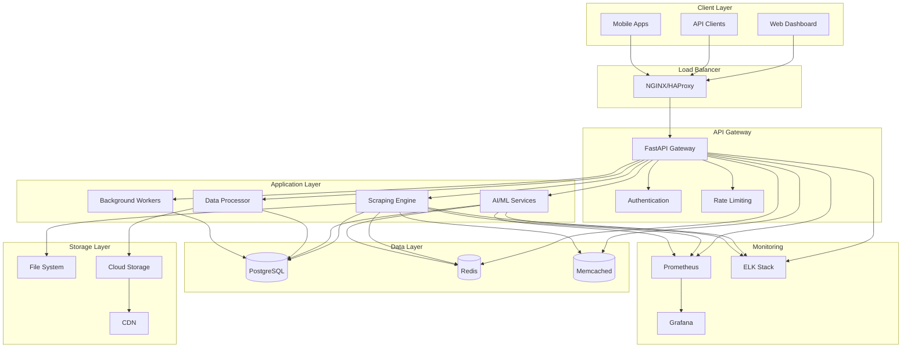
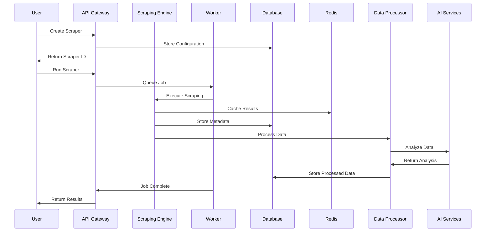
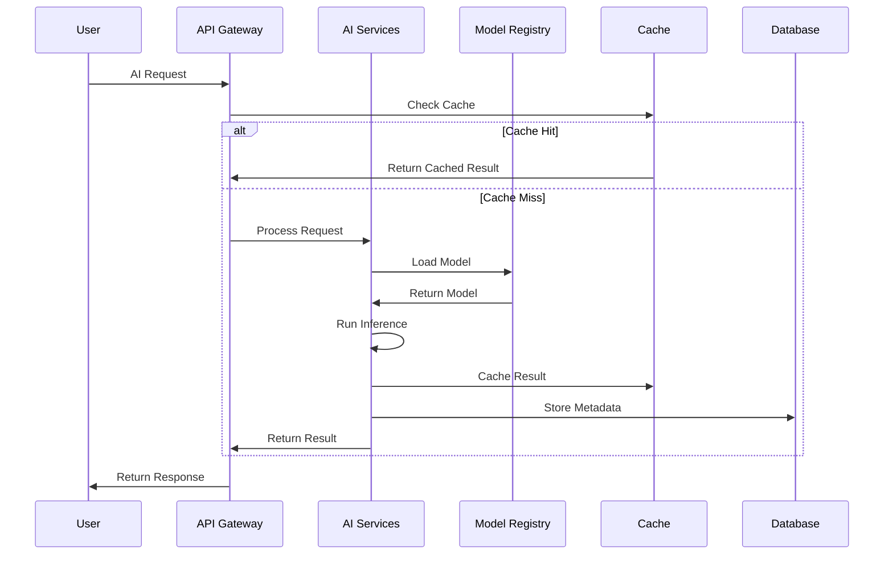
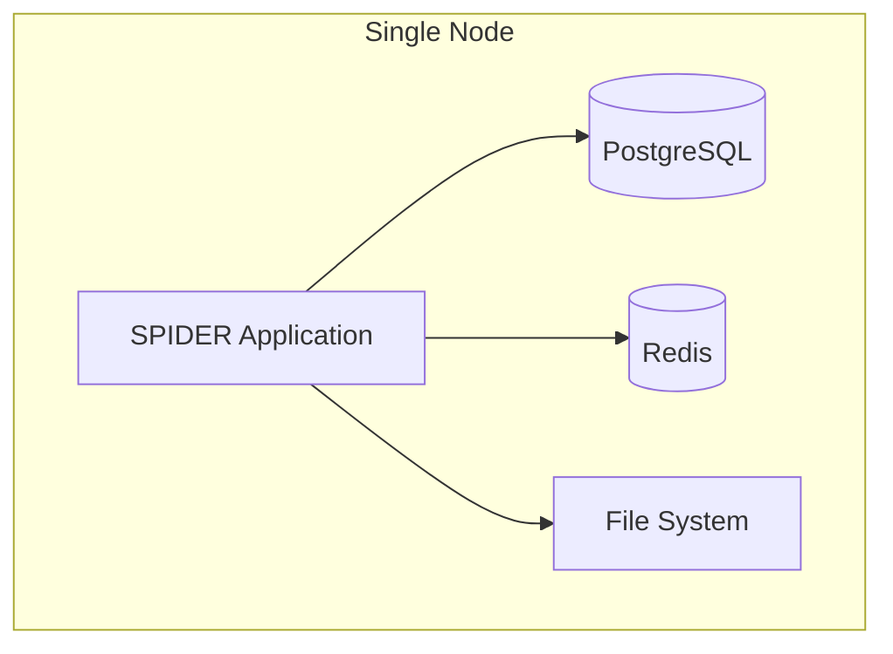
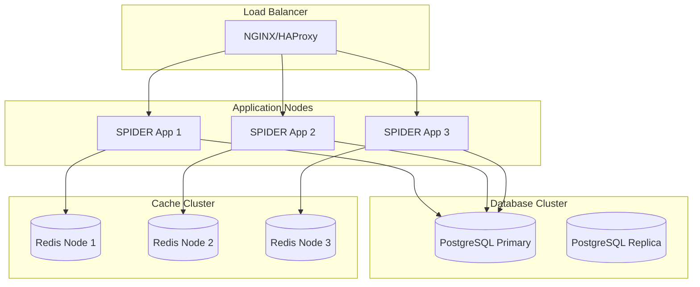
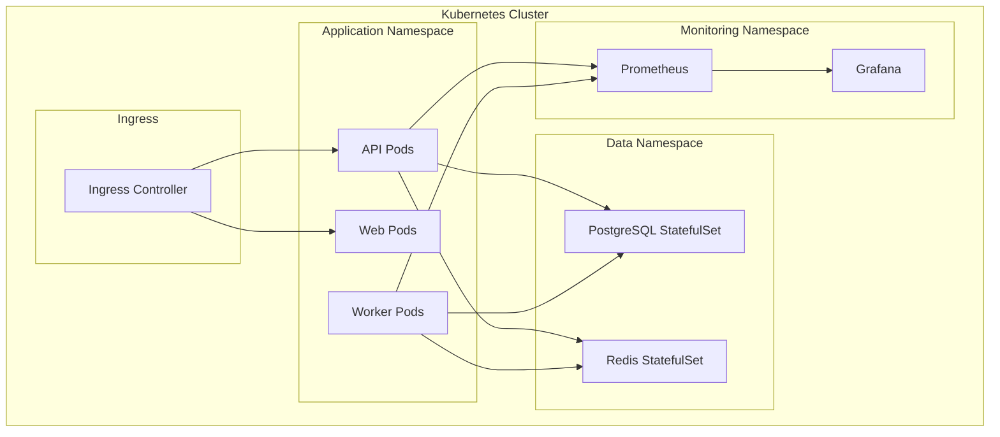
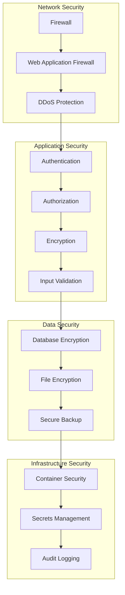
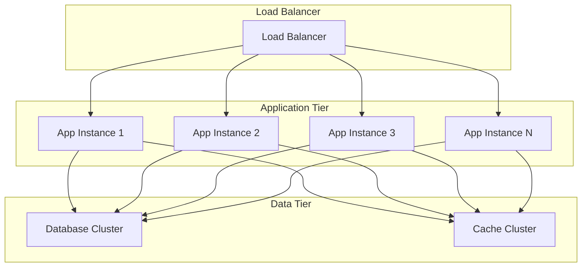
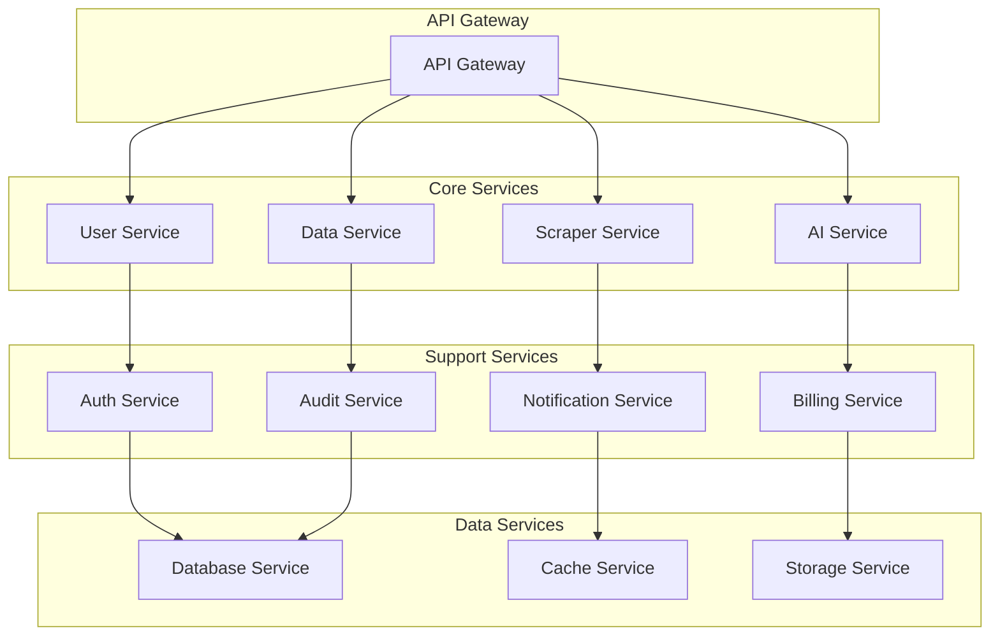

# SPIDER Framework - Architecture Guide

## Table of Contents
1. [Architecture Overview](#architecture-overview)
2. [System Components](#system-components)
3. [Data Flow](#data-flow)
4. [Technology Stack](#technology-stack)
5. [Deployment Architecture](#deployment-architecture)
6. [Security Architecture](#security-architecture)
7. [Scalability Design](#scalability-design)
8. [Integration Patterns](#integration-patterns)
9. [Performance Considerations](#performance-considerations)
10. [Future Architecture](#future-architecture)

## Architecture Overview

SPIDER Framework is designed as a modern, cloud-native, enterprise-grade web scraping platform with AI/ML capabilities, built for scale, security, and performance.

### High-Level Architecture

## System Components

### Core Components

#### 1. API Gateway
- **Technology**: FastAPI
- **Purpose**: Central entry point for all API requests
- **Features**:
  - Authentication and authorization
  - Rate limiting and throttling
  - Request/response transformation
  - API versioning
  - CORS handling

#### 2. Scraping Engine
- **Technology**: Scrapy, Playwright, HTTPX
- **Purpose**: Web scraping and data extraction
- **Features**:
  - Multi-engine support
  - Proxy rotation
  - CAPTCHA solving
  - Rate limiting
  - Session management

#### 3. AI/ML Services
- **Technology**: PyTorch, TensorFlow, scikit-learn
- **Purpose**: Intelligent data processing and analysis
- **Features**:
  - Natural language processing
  - Computer vision
  - Predictive analytics
  - Model management
  - Real-time inference

#### 4. Data Processor
- **Technology**: Custom ETL pipeline
- **Purpose**: Data transformation and validation
- **Features**:
  - Data cleaning and normalization
  - Quality scoring
  - Validation rules
  - Data enrichment
  - Export capabilities

#### 5. Background Workers
- **Technology**: Celery, RQ
- **Purpose**: Asynchronous task processing
- **Features**:
  - Job queuing
  - Task scheduling
  - Retry mechanisms
  - Progress tracking
  - Error handling

### Data Components

#### 1. PostgreSQL Database
- **Purpose**: Primary data storage
- **Data Types**:
  - User and tenant data
  - Scraper configurations
  - Job metadata
  - System settings
  - Audit logs

#### 2. Redis Cache
- **Purpose**: Caching and session storage
- **Data Types**:
  - Session data
  - API response cache
  - Rate limiting counters
  - Job queues
  - Real-time data

#### 3. Memcached
- **Purpose**: High-performance caching
- **Data Types**:
  - Frequently accessed data
  - Computed results
  - Template cache
  - Configuration cache

### Storage Components

#### 1. File System
- **Purpose**: Local file storage
- **Data Types**:
  - Scraped data files
  - Log files
  - Temporary files
  - Model files

#### 2. Cloud Storage
- **Purpose**: Distributed file storage
- **Data Types**:
  - Large datasets
  - Backup files
  - Model artifacts
  - Static assets

#### 3. CDN
- **Purpose**: Content delivery
- **Data Types**:
  - Static assets
  - API responses
  - Cached content
  - Media files

## Data Flow

### Scraping Workflow

### AI/ML Workflow

## Technology Stack

### Backend Technologies

#### Core Framework
- **FastAPI**: Modern, fast web framework for building APIs
- **Python 3.9+**: Programming language
- **Pydantic**: Data validation and settings management
- **SQLAlchemy**: ORM for database operations
- **Alembic**: Database migration tool

#### Scraping Technologies
- **Scrapy**: Web scraping framework
- **Playwright**: Browser automation
- **HTTPX**: Modern HTTP client
- **BeautifulSoup**: HTML parsing
- **Selenium**: Web driver automation

#### AI/ML Technologies
- **PyTorch**: Deep learning framework
- **TensorFlow**: Machine learning platform
- **scikit-learn**: Machine learning library
- **Transformers**: Pre-trained models
- **spaCy**: Natural language processing
- **OpenCV**: Computer vision

#### Data Technologies
- **PostgreSQL**: Primary database
- **Redis**: Caching and session storage
- **Memcached**: High-performance caching
- **Pandas**: Data manipulation
- **NumPy**: Numerical computing

### Frontend Technologies

#### Web Dashboard
- **React**: Frontend framework
- **TypeScript**: Type-safe JavaScript
- **Material-UI**: Component library
- **Redux**: State management
- **Axios**: HTTP client

#### Mobile Applications
- **React Native**: Cross-platform mobile development
- **Expo**: Development platform

### Infrastructure Technologies

#### Containerization
- **Docker**: Container platform
- **Docker Compose**: Multi-container orchestration
- **Kubernetes**: Container orchestration

#### Cloud Platforms
- **AWS**: Amazon Web Services
- **Azure**: Microsoft Azure
- **GCP**: Google Cloud Platform
- **Apify**: Scraping platform

#### Monitoring
- **Prometheus**: Metrics collection
- **Grafana**: Visualization
- **ELK Stack**: Log management
- **Jaeger**: Distributed tracing

## Deployment Architecture

### Single Node Deployment

### Multi-Node Deployment

### Kubernetes Deployment

## Security Architecture

### Security Layers

### Authentication & Authorization

#### Authentication Methods
- **JWT Tokens**: Stateless authentication
- **OAuth2**: Third-party authentication
- **SAML**: Enterprise SSO
- **LDAP**: Directory services

#### Authorization Model
- **RBAC**: Role-based access control
- **ABAC**: Attribute-based access control
- **Resource-level**: Fine-grained permissions
- **Tenant-level**: Multi-tenant isolation

### Data Protection

#### Encryption
- **At Rest**: AES-256 encryption
- **In Transit**: TLS 1.3
- **Key Management**: AWS KMS, Azure Key Vault
- **Key Rotation**: Automated key rotation

#### Data Privacy
- **GDPR Compliance**: Data protection regulations
- **Data Anonymization**: PII protection
- **Data Retention**: Automated data lifecycle
- **Audit Trails**: Complete activity logging

## Scalability Design

### Horizontal Scaling

### Auto-Scaling

#### Metrics-Based Scaling
- **CPU Utilization**: Scale based on CPU usage
- **Memory Usage**: Scale based on memory consumption
- **Request Rate**: Scale based on incoming requests
- **Queue Length**: Scale based on job queue size

#### Predictive Scaling
- **Historical Patterns**: Analyze usage patterns
- **Machine Learning**: Predict future demand
- **Scheduled Scaling**: Scale based on schedules
- **Event-Driven**: Scale based on external events

### Database Scaling

#### Read Replicas
- **Primary Database**: Write operations
- **Read Replicas**: Read operations
- **Load Balancing**: Distribute read queries
- **Consistency**: Eventual consistency

#### Sharding
- **Horizontal Sharding**: Partition by tenant
- **Vertical Sharding**: Partition by feature
- **Shard Key**: Consistent hashing
- **Data Migration**: Automated shard management

## Integration Patterns

### API Integration

#### RESTful APIs
- **Resource-Based**: RESTful design
- **HTTP Methods**: GET, POST, PUT, DELETE
- **Status Codes**: Standard HTTP codes
- **Content Types**: JSON, XML support

#### GraphQL APIs
- **Query Language**: Flexible queries
- **Schema Definition**: Type system
- **Real-time**: Subscriptions
- **Introspection**: Self-documenting

#### WebSocket APIs
- **Real-time**: Bidirectional communication
- **Event Streaming**: Live updates
- **Connection Management**: Persistent connections
- **Message Types**: Structured messages

### External Integrations

#### Third-Party Services
- **Payment Gateways**: Stripe, PayPal
- **Email Services**: SendGrid, SES
- **SMS Services**: Twilio, SNS
- **Storage Services**: S3, Azure Blob

#### Enterprise Systems
- **ERP Systems**: SAP, Oracle
- **CRM Systems**: Salesforce, HubSpot
- **Analytics**: Google Analytics, Mixpanel
- **Monitoring**: New Relic, DataDog

## Performance Considerations

### Caching Strategy

#### Multi-Level Caching
- **Application Cache**: In-memory caching
- **Redis Cache**: Distributed caching
- **CDN Cache**: Edge caching
- **Database Cache**: Query result caching

#### Cache Invalidation
- **TTL-Based**: Time-to-live expiration
- **Event-Based**: Invalidate on updates
- **Version-Based**: Version-based invalidation
- **Manual**: Manual cache clearing

### Database Optimization

#### Query Optimization
- **Indexing**: Proper index design
- **Query Analysis**: Slow query identification
- **Connection Pooling**: Efficient connections
- **Query Caching**: Result caching

#### Data Partitioning
- **Table Partitioning**: Large table splitting
- **Index Partitioning**: Index optimization
- **Archive Strategy**: Historical data management
- **Compression**: Data compression

### Network Optimization

#### CDN Integration
- **Static Assets**: CSS, JS, images
- **API Responses**: Cached responses
- **Geographic Distribution**: Global content delivery
- **Compression**: Gzip, Brotli compression

#### Load Balancing
- **Round Robin**: Simple distribution
- **Least Connections**: Connection-based
- **Weighted**: Server capacity-based
- **Health Checks**: Automatic failover

## Future Architecture

### Microservices Evolution

### Event-Driven Architecture

#### Event Streaming
- **Apache Kafka**: Event streaming platform
- **Event Sourcing**: Event-based state management
- **CQRS**: Command Query Responsibility Segregation
- **Saga Pattern**: Distributed transaction management

#### Message Queues
- **RabbitMQ**: Message broker
- **Amazon SQS**: Cloud message queue
- **Azure Service Bus**: Enterprise messaging
- **Google Pub/Sub**: Cloud messaging

### AI/ML Evolution

#### MLOps Pipeline
- **Model Training**: Automated training
- **Model Deployment**: A/B testing
- **Model Monitoring**: Performance tracking
- **Model Retraining**: Continuous improvement

#### Edge Computing
- **Edge Deployment**: Local processing
- **Model Optimization**: Lightweight models
- **Offline Capability**: Disconnected operation
- **Sync Mechanisms**: Data synchronization

---

## Support

For architecture support:
- **Documentation**: [github.com/Exemplify777/spider/docs](https://github.com/Exemplify777/spider/docs)
- **Architecture Examples**: `/architecture/examples/`