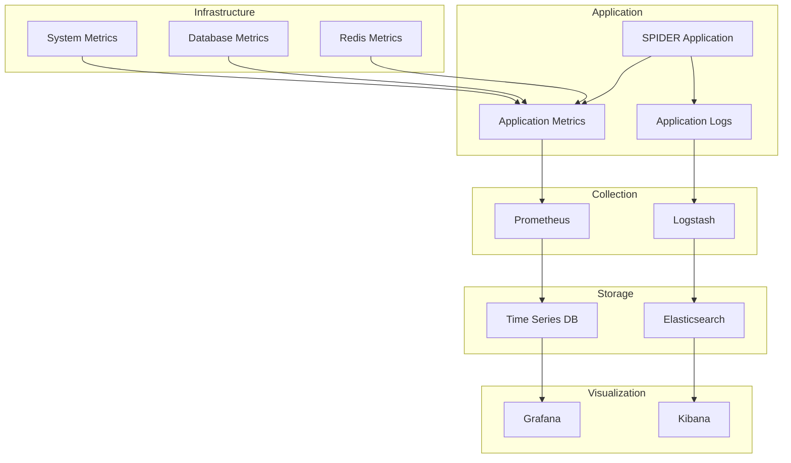

# SPIDER Framework - Monitoring Guide

## Monitoring Overview

SPIDER Framework includes comprehensive monitoring capabilities for system health, performance, and security.

### Monitoring Architecture



## Metrics Collection

### Application Metrics

```python
# spider/monitoring/metrics.py
from prometheus_client import Counter, Histogram, Gauge

# Request metrics
REQUEST_COUNT = Counter('spider_requests_total', 'Total requests', ['method', 'endpoint', 'status'])
REQUEST_DURATION = Histogram('spider_request_duration_seconds', 'Request duration', ['method', 'endpoint'])

# Scraping metrics
SCRAPER_RUNS = Counter('spider_scraper_runs_total', 'Total scraper runs', ['scraper_id', 'status'])
SCRAPER_DURATION = Histogram('spider_scraper_duration_seconds', 'Scraper duration', ['scraper_id'])
SCRAPER_ITEMS = Counter('spider_scraper_items_total', 'Items scraped', ['scraper_id'])

# AI/ML metrics
AI_PREDICTIONS = Counter('spider_ai_predictions_total', 'AI predictions', ['model', 'type'])
AI_DURATION = Histogram('spider_ai_duration_seconds', 'AI processing duration', ['model', 'type'])

# System metrics
MEMORY_USAGE = Gauge('spider_memory_usage_bytes', 'Memory usage')
CPU_USAGE = Gauge('spider_cpu_usage_percent', 'CPU usage')
ACTIVE_CONNECTIONS = Gauge('spider_active_connections', 'Active connections')
```

### Infrastructure Metrics

```python
# spider/monitoring/system_metrics.py
import psutil
from prometheus_client import Gauge

# System resource metrics
SYSTEM_CPU = Gauge('system_cpu_usage_percent', 'System CPU usage')
SYSTEM_MEMORY = Gauge('system_memory_usage_bytes', 'System memory usage')
SYSTEM_DISK = Gauge('system_disk_usage_bytes', 'System disk usage', ['device'])

def collect_system_metrics():
    """Collect system metrics."""
    SYSTEM_CPU.set(psutil.cpu_percent())
    memory = psutil.virtual_memory()
    SYSTEM_MEMORY.set(memory.used)
    
    for partition in psutil.disk_partitions():
        usage = psutil.disk_usage(partition.mountpoint)
        SYSTEM_DISK.labels(device=partition.device).set(usage.used)
```

## Logging

### Log Configuration

```python
# spider/logging/config.py
import logging
import logging.handlers
from pythonjsonlogger import jsonlogger

def setup_logging(level='INFO', format_type='json'):
    """Setup logging configuration."""
    logger = logging.getLogger('spider')
    logger.setLevel(getattr(logging, level.upper()))
    
    if format_type == 'json':
        formatter = jsonlogger.JsonFormatter(
            '%(asctime)s %(name)s %(levelname)s %(message)s'
        )
    else:
        formatter = logging.Formatter(
            '%(asctime)s - %(name)s - %(levelname)s - %(message)s'
        )
    
    # Console handler
    console_handler = logging.StreamHandler()
    console_handler.setFormatter(formatter)
    logger.addHandler(console_handler)
    
    # File handler
    file_handler = logging.handlers.RotatingFileHandler(
        '/var/log/spider/spider.log',
        maxBytes=100*1024*1024,  # 100MB
        backupCount=10
    )
    file_handler.setFormatter(formatter)
    logger.addHandler(file_handler)
    
    return logger
```

### Structured Logging

```python
# spider/logging/structured.py
import logging
from datetime import datetime

class StructuredLogger:
    def __init__(self, name):
        self.logger = logging.getLogger(name)
    
    def log_request(self, method, endpoint, status_code, duration, user_id=None):
        """Log HTTP request."""
        self.logger.info(
            "HTTP request",
            extra={
                'event_type': 'http_request',
                'method': method,
                'endpoint': endpoint,
                'status_code': status_code,
                'duration': duration,
                'user_id': user_id,
                'timestamp': datetime.utcnow().isoformat()
            }
        )
    
    def log_scraper_run(self, scraper_id, status, duration, items_count, error=None):
        """Log scraper run."""
        self.logger.info(
            "Scraper run",
            extra={
                'event_type': 'scraper_run',
                'scraper_id': scraper_id,
                'status': status,
                'duration': duration,
                'items_count': items_count,
                'error': error,
                'timestamp': datetime.utcnow().isoformat()
            }
        )
```

## Alerting

### Alert Rules

```yaml
# monitoring/alert_rules.yml
groups:
  - name: spider.rules
    rules:
      - alert: HighErrorRate
        expr: rate(spider_errors_total[5m]) > 0.1
        for: 2m
        labels:
          severity: warning
        annotations:
          summary: "High error rate detected"
          description: "Error rate is {{ $value }} errors per second"
      
      - alert: HighMemoryUsage
        expr: spider_memory_usage_bytes / spider_memory_limit_bytes > 0.8
        for: 5m
        labels:
          severity: critical
        annotations:
          summary: "High memory usage"
          description: "Memory usage is {{ $value | humanizePercentage }}"
      
      - alert: DatabaseConnectionFailure
        expr: spider_database_connections_failed_total > 0
        for: 1m
        labels:
          severity: critical
        annotations:
          summary: "Database connection failure"
          description: "Database connection failed {{ $value }} times"
      
      - alert: ScraperFailure
        expr: spider_scraper_failures_total > 5
        for: 2m
        labels:
          severity: warning
        annotations:
          summary: "Scraper failures detected"
          description: "{{ $value }} scraper failures in the last 5 minutes"
```

### Alertmanager Configuration

```yaml
# monitoring/alertmanager.yml
global:
  smtp_smarthost: 'smtp.example.com:587'
  smtp_from: 'alerts@example.com'

route:
  group_by: ['alertname']
  group_wait: 10s
  group_interval: 10s
  repeat_interval: 1h
  receiver: 'web.hook'

receivers:
  - name: 'web.hook'
    webhook_configs:
      - url: 'http://webhook.example.com/alerts'
  
  - name: 'email'
    email_configs:
      - to: 'admin@example.com'
        subject: 'SPIDER Alert: {{ .GroupLabels.alertname }}'
        body: |
          {{ range .Alerts }}
          Alert: {{ .Annotations.summary }}
          Description: {{ .Annotations.description }}
          {{ end }}
  
  - name: 'slack'
    slack_configs:
      - api_url: 'https://hooks.slack.com/services/...'
        channel: '#alerts'
        title: 'SPIDER Alert'
        text: |
          {{ range .Alerts }}
          *{{ .Annotations.summary }}*
          {{ .Annotations.description }}
          {{ end }}
```

## Dashboards

### System Overview Dashboard

```json
{
  "dashboard": {
    "title": "SPIDER System Overview",
    "panels": [
      {
        "title": "Request Rate",
        "type": "graph",
        "targets": [
          {
            "expr": "rate(spider_requests_total[5m])",
            "legendFormat": "{{instance}}"
          }
        ]
      },
      {
        "title": "Error Rate",
        "type": "graph",
        "targets": [
          {
            "expr": "rate(spider_errors_total[5m])",
            "legendFormat": "{{instance}}"
          }
        ]
      },
      {
        "title": "Memory Usage",
        "type": "graph",
        "targets": [
          {
            "expr": "spider_memory_usage_bytes",
            "legendFormat": "{{instance}}"
          }
        ]
      },
      {
        "title": "Active Scrapers",
        "type": "singlestat",
        "targets": [
          {
            "expr": "spider_active_scrapers",
            "legendFormat": "Active Scrapers"
          }
        ]
      }
    ]
  }
}
```

### Scraping Metrics Dashboard

```json
{
  "dashboard": {
    "title": "SPIDER Scraping Metrics",
    "panels": [
      {
        "title": "Scraper Success Rate",
        "type": "graph",
        "targets": [
          {
            "expr": "rate(spider_scraper_runs_total{status=\"success\"}[5m]) / rate(spider_scraper_runs_total[5m])",
            "legendFormat": "{{scraper_id}}"
          }
        ]
      },
      {
        "title": "Items Scraped",
        "type": "graph",
        "targets": [
          {
            "expr": "rate(spider_scraper_items_total[5m])",
            "legendFormat": "{{scraper_id}}"
          }
        ]
      },
      {
        "title": "Scraper Duration",
        "type": "graph",
        "targets": [
          {
            "expr": "histogram_quantile(0.95, spider_scraper_duration_seconds_bucket)",
            "legendFormat": "{{scraper_id}}"
          }
        ]
      }
    ]
  }
}
```

## Health Checks

### Application Health Check

```python
# spider/health/checks.py
import asyncio
from typing import Dict, Any
from spider.database import get_db
from spider.redis import get_redis

class HealthChecker:
    def __init__(self):
        self.checks = {
            'database': self.check_database,
            'redis': self.check_redis,
            'ai_services': self.check_ai_services
        }
    
    async def check_database(self) -> Dict[str, Any]:
        """Check database health."""
        try:
            db = get_db()
            with db.cursor() as cursor:
                cursor.execute("SELECT 1")
                result = cursor.fetchone()
                if result:
                    return {'status': 'healthy', 'response_time': 0.1}
        except Exception as e:
            return {'status': 'unhealthy', 'error': str(e)}
    
    async def check_redis(self) -> Dict[str, Any]:
        """Check Redis health."""
        try:
            redis_client = get_redis()
            redis_client.ping()
            return {'status': 'healthy', 'response_time': 0.05}
        except Exception as e:
            return {'status': 'unhealthy', 'error': str(e)}
    
    async def check_ai_services(self) -> Dict[str, Any]:
        """Check AI services health."""
        try:
            from spider.ai import AIManager
            ai_manager = AIManager()
            models_loaded = ai_manager.get_loaded_models()
            return {'status': 'healthy', 'models_loaded': len(models_loaded)}
        except Exception as e:
            return {'status': 'unhealthy', 'error': str(e)}
    
    async def run_all_checks(self) -> Dict[str, Any]:
        """Run all health checks."""
        results = {}
        for check_name, check_func in self.checks.items():
            results[check_name] = await check_func()
        return results
```

### Health Check Endpoints

```python
# spider/api/health.py
from fastapi import APIRouter, HTTPException
from spider.health.checks import HealthChecker

router = APIRouter()

@router.get("/health")
async def health_check():
    """Basic health check."""
    return {"status": "healthy", "timestamp": "2024-01-01T12:00:00Z"}

@router.get("/health/detailed")
async def detailed_health_check():
    """Detailed health check."""
    checker = HealthChecker()
    results = await checker.run_all_checks()
    
    overall_status = "healthy"
    for check_name, result in results.items():
        if result.get('status') != 'healthy':
            overall_status = "unhealthy"
            break
    
    return {
        "status": overall_status,
        "timestamp": "2024-01-01T12:00:00Z",
        "checks": results
    }

@router.get("/ready")
async def readiness_check():
    """Readiness check for Kubernetes."""
    checker = HealthChecker()
    results = await checker.run_all_checks()
    
    critical_services = ['database', 'redis']
    for service in critical_services:
        if results.get(service, {}).get('status') != 'healthy':
            raise HTTPException(status_code=503, detail=f"Service {service} is not ready")
    
    return {"status": "ready"}
```

## Performance Monitoring

### Performance Metrics

```python
# spider/monitoring/performance.py
from prometheus_client import Histogram, Summary, Gauge
import time
from functools import wraps

# Performance metrics
REQUEST_DURATION = Histogram('spider_request_duration_seconds', 'Request duration', ['method', 'endpoint'])
FUNCTION_DURATION = Summary('spider_function_duration_seconds', 'Function duration', ['function_name'])
MEMORY_USAGE = Gauge('spider_memory_usage_bytes', 'Memory usage')
CPU_USAGE = Gauge('spider_cpu_usage_percent', 'CPU usage')

def monitor_performance(func):
    """Decorator to monitor function performance."""
    @wraps(func)
    async def wrapper(*args, **kwargs):
        start_time = time.time()
        try:
            result = await func(*args, **kwargs)
            return result
        finally:
            duration = time.time() - start_time
            FUNCTION_DURATION.labels(function_name=func.__name__).observe(duration)
    return wrapper

def monitor_memory():
    """Monitor memory usage."""
    import psutil
    process = psutil.Process()
    memory_info = process.memory_info()
    MEMORY_USAGE.set(memory_info.rss)

def monitor_cpu():
    """Monitor CPU usage."""
    import psutil
    cpu_percent = psutil.cpu_percent()
    CPU_USAGE.set(cpu_percent)
```

## Security Monitoring

### Security Events

```python
# spider/monitoring/security.py
from prometheus_client import Counter, Histogram
import logging

# Security metrics
AUTHENTICATION_ATTEMPTS = Counter('spider_auth_attempts_total', 'Authentication attempts', ['status'])
AUTHORIZATION_FAILURES = Counter('spider_authz_failures_total', 'Authorization failures', ['resource', 'action'])
SECURITY_EVENTS = Counter('spider_security_events_total', 'Security events', ['event_type', 'severity'])

class SecurityMonitor:
    def __init__(self):
        self.logger = logging.getLogger('spider.security')
    
    def log_authentication_attempt(self, username, success, ip_address):
        """Log authentication attempt."""
        status = 'success' if success else 'failure'
        AUTHENTICATION_ATTEMPTS.labels(status=status).inc()
        
        self.logger.info(
            "Authentication attempt",
            extra={
                'event_type': 'authentication',
                'username': username,
                'success': success,
                'ip_address': ip_address
            }
        )
    
    def log_authorization_failure(self, user_id, resource, action, ip_address):
        """Log authorization failure."""
        AUTHORIZATION_FAILURES.labels(resource=resource, action=action).inc()
        
        self.logger.warning(
            "Authorization failure",
            extra={
                'event_type': 'authorization_failure',
                'user_id': user_id,
                'resource': resource,
                'action': action,
                'ip_address': ip_address
            }
        )
```

## Business Metrics

### Business Intelligence

```python
# spider/monitoring/business.py
from prometheus_client import Counter, Gauge
from datetime import datetime

# Business metrics
ACTIVE_USERS = Gauge('spider_active_users', 'Active users')
TENANT_COUNT = Gauge('spider_tenants_total', 'Total tenants')
DATA_VOLUME = Counter('spider_data_volume_bytes', 'Data volume processed', ['tenant_id'])
REVENUE = Counter('spider_revenue_total', 'Revenue', ['tenant_id', 'plan'])

class BusinessMetrics:
    def __init__(self):
        self.logger = logging.getLogger('spider.business')
    
    def track_user_activity(self, user_id, action, tenant_id):
        """Track user activity."""
        ACTIVE_USERS.inc()
        
        self.logger.info(
            "User activity",
            extra={
                'event_type': 'user_activity',
                'user_id': user_id,
                'action': action,
                'tenant_id': tenant_id,
                'timestamp': datetime.utcnow().isoformat()
            }
        )
    
    def track_data_processing(self, tenant_id, data_size):
        """Track data processing."""
        DATA_VOLUME.labels(tenant_id=tenant_id).inc(data_size)
        
        self.logger.info(
            "Data processing",
            extra={
                'event_type': 'data_processing',
                'tenant_id': tenant_id,
                'data_size': data_size,
                'timestamp': datetime.utcnow().isoformat()
            }
        )
```

## Troubleshooting

### Common Issues

#### High Memory Usage
```bash
# Check memory usage
free -h
ps aux --sort=-%mem | head -10

# Check application memory
curl -s http://localhost:8000/metrics | grep memory
```

#### Database Performance Issues
```sql
-- Check slow queries
SELECT query, mean_time, calls 
FROM pg_stat_statements 
ORDER BY mean_time DESC 
LIMIT 10;

-- Check connection usage
SELECT count(*) FROM pg_stat_activity;
```

#### Redis Performance Issues
```bash
# Check Redis memory usage
redis-cli info memory

# Check Redis performance
redis-cli --latency
```

### Debug Mode

```bash
# Enable debug mode
export SPIDER_DEBUG=true

# Or use command line flag
python -m spider.main --debug
```

### Log Analysis

```bash
# View recent logs
tail -f logs/spider.log

# Search for errors
grep "ERROR" logs/spider.log

# Analyze performance
grep "PERFORMANCE" logs/spider.log | jq
```

---

## Support

For monitoring support:
- **Documentation**: [github.com/Exemplify777/spider/docs](https://github.com/Exemplify777/spider/docs)
- **Monitoring Examples**: `/monitoring/examples/`